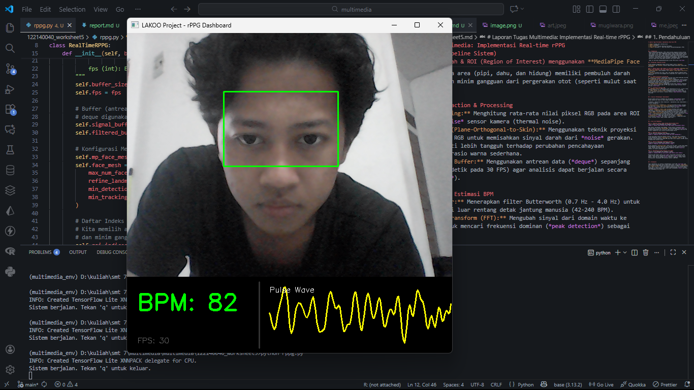
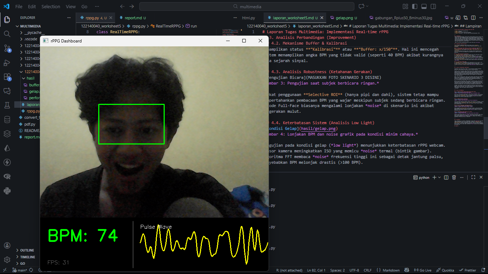
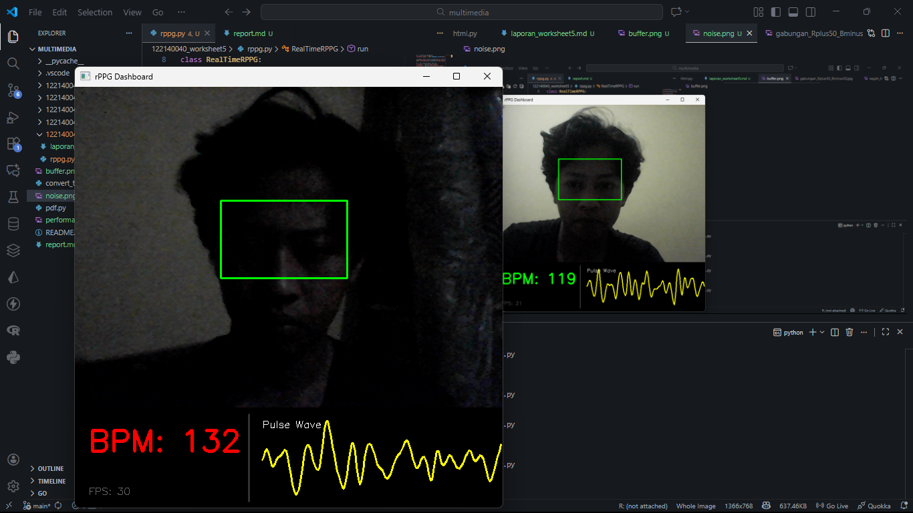

# Laporan Tugas Multimedia: Implementasi Real-time rPPG

* **Nama:** Naufal Haris Nurkhoirulloh
* **NIM:** 122140040
* **Mata Kuliah:** Sistem Teknologi Multimedia
* **Tugas:** Worksheet 5 - Real-time Remote Photoplethysmography (rPPG)

---

## 1. Pendahuluan
 Remote Photoplethysmography (rPPG) adalah metode pengukuran detak jantung tanpa kontak fisik, hanya menggunakan kamera untuk merekam perubahan warna kulit akibat aliran darah. rPPG memanfaatkan fenomena bahwa denyut jantung menyebabkan variasi kecil pada intensitas cahaya yang dipantulkan kulit, terutama di area wajah yang kaya pembuluh darah kapiler. Saat jantung memompa (sistolik), volume darah di wajah meningkat, menyebabkan penurunan intensitas pantulan cahaya hijau yang dapat dideteksi oleh sensor kamera.
 
 Tugas ini bertujuan mengimplementasikan sistem rPPG secara *real-time*.

## 2. Metodologi (Pipeline Sistem)

Sistem dibangun menggunakan bahasa Python dengan library **OpenCV**, **MediaPipe**, dan **SciPy**. Berikut adalah tahapan pemrosesan sinyal yang diterapkan:

### 2.1. Deteksi Wajah & ROI (Region of Interest) menggunakan **MediaPipe Face Mesh** untuk mendeteksi 468 titik landmark wajah secara *real-time*.
* **Pemilihan ROI:** Saya mengambil area **Dahi**, **Pipi Kanan & Pipi Kiri**(baris 44:48).
* **Alasan:** Kareana area (pipi, dahu, dan hidung) memiliki pembuluh darah kapiler yang kuat dan minim gangguan dari pergerakan otot (seperti mulut saat berbicara). 

### 2.2. Signal Extraction & Processing
1.  **Spatial Averaging:** Menghitung rata-rata nilai piksel RGB pada area ROI untuk mengurangi *noise* sensor kamera (thermal noise).
2.  **Algoritma POS (Plane-Orthogonal-to-Skin):** Menggunakan teknik proyeksi ortogonal pada kanal RGB untuk memisahkan sinyal darah dari *noise* gerakan. Algoritma POS terbukti lebih tangguh terhadap perubahan pencahayaan dibandingkan metode rasio warna sederhana.
3.  **Sliding Window Buffer:** Menggunakan antrean data (*deque*) sepanjang 150 frame (setara 5 detik pada 30 FPS) agar analisis dapat berjalan secara kontinyu (*real-time*).

### 2.3. Filtering & Estimasi BPM
1.  **Bandpass Filter:** Menerapkan filter Butterworth (0.7 Hz - 4.0 Hz) untuk membuang frekuensi di luar rentang detak jantung manusia (42-240 BPM).
2.  **Fast Fourier Transform (FFT):** Mengubah sinyal dari domain waktu ke domain frekuensi untuk mencari frekuensi dominan (*peak detection*) sebagai nilai BPM.

---

## 3. Analisis Perbandingan (Improvement)

Implementasi yang saya buat di tugas ini punya beberapa perbedaan dibanding demonstrasi yang dilakukan Pak Martin di kelas. Berikut detailnya:

Pertama, soal cara kerjanya. Waktu demonstrasi di kelas, Pak Martin harus rekam video wajah dulu, videonya disimpan, baru setelah itu programnya dijalankan untuk memproses video tersebut dari awal sampai habis (Sequential/Offline). Nah tugas saya mencoba membuat real-time program langsung baca webcam laptop saat itu juga, terus datanya diproses langsung frame demi frame pakai sistem sliding window. Jadi kita bisa lihat detak jantung berubah secara langsung (live) tanpa perlu repot rekam-rekam dulu.

Kedua, soal cara deteksi wajah. Demo di kelas deteksi wajah pakai Dlib yang bikin kotak di wajah. Kelemahannya, kalau kepala kita miring dikit, kotaknya sering hilang. Di sini saya ganti pakai MediaPipe Face Mesh dimana dia deteksi titik-titik (landmark) wajah secara 3D. Jadi mau kepala saya miring atau goyang pun, area deteksinya tetap nempel presisi di kulit.

Ketiga, soal area yang diambil (ROI). Di kelas, Pak Martin ambil rata-rata warna dari satu muka full (satu kotak). Masalahnya, itu mata (yang kedip) dan mulut (yang gerak) ikut dihitung, jadinya banyak noise. Perbedaan saya difilter biar cuma ambil area Dahi dan Pipi saja dimaan area ini pembuluh darahnya banyak tapi kulitnya gak banyak gerak, jadi sinyal detak jantungnya jauh lebih bersih.

Terakhir, soal tampilan. Saya bikin Dashboard UI overlay di webcam ada grafik gelombang (wave) yang jalan terus di bawah, ada FPS counter biar tau nge-lag atau nggak, dan ada status buffer. Jadi lebih kelihatan kalau ini beneran lagi mikir (proses data), bukan cuma nampilin angka asal-asalan.
```markdown
---

## 4. Hasil dan Pembahasan

### 4.1. Pengujian Kondisi Ideal (Normal Resting Heart Rate)

*Gambar 1: Deteksi detak jantung stabil pada kondisi pencahayaan cukup.*

Pada kondisi pencahayaan yang memadai, sistem berhasil mendeteksi detak jantung stabil di kisaran **60-90 BPM**. Grafik gelombang (*Pulse Wave*) di dashboard menunjukkan pola sinusoidal yang teratur, menandakan algoritma POS berhasil mengekstrak fase sistolik jantung dengan bersih.
```

### 4.2. Mekanisme Buffer & Kalibrasi

*Gambar 2: Tampilan status kalibrasi saat data awal dikumpulkan.*

Sistem menerapkan mekanisme keamanan (Buffer). Saat wajah baru terdeteksi, sistem menampilkan status **"Kalibrasi"** atau **"Buffer: x/150"**. Hal ini mencegah sistem menampilkan angka BPM yang tidak valid (seperti 40 BPM) akibat kurangnya data sejarah sinyal.

### 4.3. Analisis Robustness (Ketahanan Gerakan)

*Gambar 3: Pengujian saat subjek berbicara ringan.*

Berkat penggunaan **Selective ROI** (hanya pipi dan dahi), sistem tetap mampu mempertahankan pembacaan BPM yang wajar meskipun subjek sedang berbicara ringan. Metode Full-Face biasanya mengalami lonjakan *noise* di skenario ini akibat pergerakan mulut.

### 4.4. Keterbatasan Sistem (Analisis Low Light)

*Gambar 4: Lonjakan BPM dan noise grafik pada kondisi minim cahaya.*

Pengujian pada kondisi gelap (*low light*) menunjukkan keterbatasan rPPG webcam. Sensor kamera meningkatkan ISO yang memicu *noise* termal (bintik gambar). Algoritma FFT membaca *noise* frekuensi tinggi ini sebagai detak jantung palsu, menyebabkan BPM melonjak drastis (>100 BPM).

---

## 5. Kesimpulan

Tugas implementasi ini berhasil mengembangkan sistem rPPG *real-time* yang lebih canggih dibandingkan materi dasar perkuliahan. Penggunaan **MediaPipe** dan **Algoritma POS** terbukti meningkatkan stabilitas sinyal terhadap gerakan kecil. Namun, akurasi sistem masih sangat bergantung pada intensitas cahaya lingkungan, di mana kondisi minim cahaya dapat menyebabkan *noise* signifikan yang mengganggu perhitungan FFT.

## Lampiran
[Gemini AI Referensi](https://gemini.google.com/share/b42ae1ab3db9)